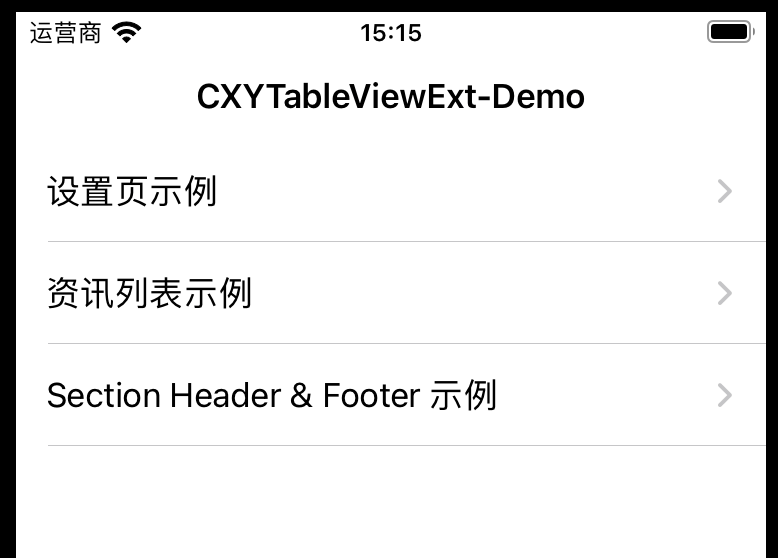
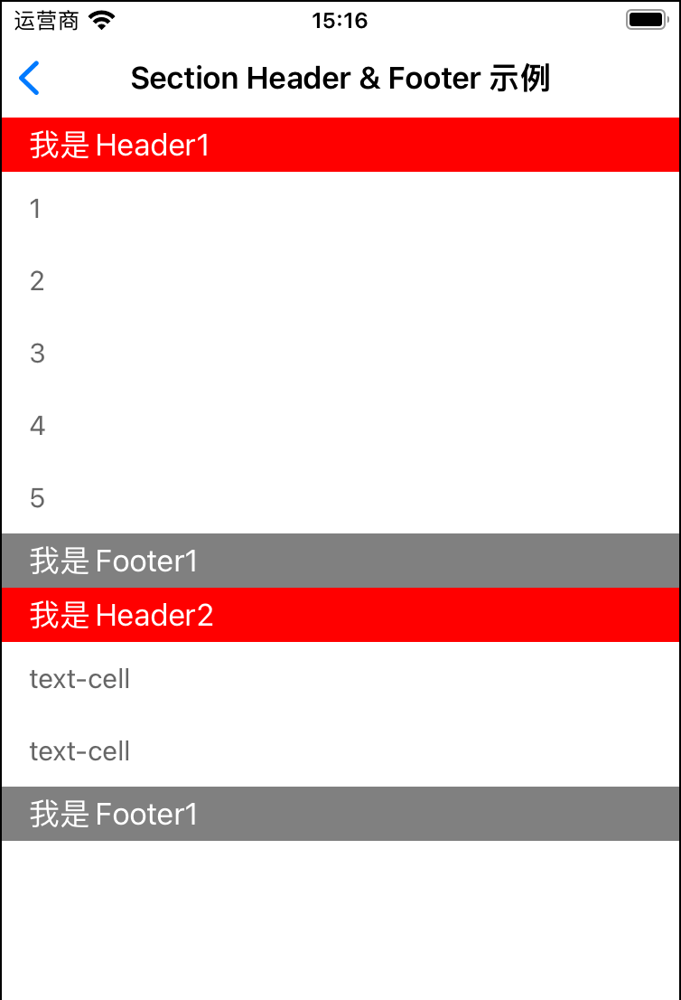

# CXYTableViewExt-OC
Make it easier for you to configure and use UITableView.

#### 几乎在你用到 UITableView 的地方，都可以使用 CXYTableViewExt 来简化代码和逻辑。

使用 CXYTableViewExt， 大多数时候你都无需编写类似下面的代码

```objective-c
self.tableView.dataSource = self;
self.tableView.delegate = self;
[self.tableView registerNib:[UINib nibWithNibName:@"SwitchCell" bundle:nil] forCellReuseIdentifier:@"SwitchCell"];
[self.tableView registerNib:[UINib nibWithNibName:@"ArrowTextCell" bundle:nil] forCellReuseIdentifier:@"ArrowTextCell"];

#pragma mark - <UITableViewDelegate,UITableViewDataSource>
- (NSInteger)numberOfSectionsInTableView:(UITableView *)tableView {}

- (NSInteger)tableView:(UITableView *)tableView numberOfRowsInSection:(NSInteger)section{}

- (UITableViewCell *)tableView:(UITableView *)tableView cellForRowAtIndexPath:(NSIndexPath *)indexPath {}

- (void)tableView:(UITableView *)tableView didSelectRowAtIndexPath:(NSIndexPath *)indexPath {}
```


# 如何使用

#### 简单使用



如需实现上面的UI界面：

1、让 ArrowTextCell 实现 CXYTableItemProtocol 的协议

```objective-c
@interface ArrowTextCell ()<CXYTableItemProtocol>
@end
@implementation ArrowTextCell

#pragma mark - CXYTableItemProtocol
- (void)configData:(id)data {
    self.title.text = data;
}
```

2、无需为 tableView 设置 dataSource 和 delegate，也不需要注册 Cell。

```objective-c
- (void)bindViewData {
    __weak typeof(self) weakSelf = self;
    
    [self.tableView.t makeItems:^(CXYTable * _Nonnull make) {
        
        [make addCellClass:ArrowTextCell.class data:@"设置页示例" didSelectBlock:^(id  _Nonnull data, NSIndexPath * _Nonnull indexPath) {
          
        }];
        
        [make addCellClass:ArrowTextCell.class data:@"资讯列表示例" didSelectBlock:^(id  _Nonnull data, NSIndexPath * _Nonnull indexPath) {
          
        }];
        
        [make addCellClass:ArrowTextCell.class data:@"Section Header & Footer 示例" didSelectBlock:^(id  _Nonnull data, NSIndexPath * _Nonnull indexPath) {
          
        }];
    }];
    
}
```


#### 类设置页


1、有时我们需要响应 Cell 里的一些动作，我们可以在配置 Cell 时，给它设置一个代理对象

```objective-c
- (void)addCellClass:(Class)cellClass data:(id)data delegate:(id)delegate
```

2、在 Cell 定义一些 delegate 需要实现的协议

```
@protocol SwitchCellDelegate <NSObject>
- (void)switchCellDelegateSwitchChanged:(id)data;
@end

@interface SwitchCell ()<CXYTableItemProtocol>
@property (nonatomic, weak) id delegate;
@property (nonatomic, strong) SwitchModel *model;
@end

@implementation SwitchCell

- (IBAction)onSwitch:(UISwitch*)sender {
    if ([self.delegate respondsToSelector:@selector(switchCellDelegateSwitchChanged:)]) {
        [self.delegate switchCellDelegateSwitchChanged:self.model];
    }
}

#pragma mark - CXYTableItemProtocol
- (void)configData:(SwitchModel*)data indexPath:(NSIndexPath *)indexPath delegate:(id)delegate {
    self.model = data;
    self.delegate = delegate;
    ...
}

@end
```

3、让这个代理对象遵循你的协议，从而将 Cell 的动作传递给 delegate 响应

```
- (void)bindViewData {
    
    [self.tableView.t makeItems:^(CXYTable * _Nonnull make) {
        [make addCellClass:HeadTitleCell.class data:@"通知"];
        [make addCellClass:SwitchCell.class data:[SwitchModel title:@"系统消息通知" isOn:YES] delegate:self];
        [make addCellClass:SwitchCell.class data:[SwitchModel title:@"通知显示消息详情" isOn:NO] delegate:self];
        [make addCellClass:SwitchCell.class data:[SwitchModel title:@"振动" isOn:YES] delegate:self];

        [make addCellClass:HeadTitleCell.class data:@"提示音"];
        [make addCellClass:ArrowTextCell.class data:@"消息提示音" didSelectBlock:^(id  _Nonnull data, NSIndexPath * _Nonnull indexPath) {
            NSLog(@"%@",data);
        }];
        [make addCellClass:ArrowTextCell.class data:@"来电铃声" didSelectBlock:^(id  _Nonnull data, NSIndexPath * _Nonnull indexPath) {
            NSLog(@"%@",data);
        }];
    }];
}

#pragma mark - SwitchCellDelegate
- (void)switchCellDelegateSwitchChanged:(SwitchModel*)data {
    data.isOn = !data.isOn;
    NSLog(@"%@ %@",data.title, @(data.isOn));
}

```


#### 列表


每次你的数据变化时，直接重新绑定数据就行。如果你觉得性能有影响，那可以使用 CXYTable.h 里的一些插入、添加、更新、删除方法。

```objective-c
- (void)requestPage:(NSInteger)page {
    // 模拟请求，假数据
    dispatch_after(dispatch_time(DISPATCH_TIME_NOW, (int64_t)(1 * NSEC_PER_SEC)), dispatch_get_main_queue(), ^{
        NSMutableArray *res = @[].mutableCopy;
        for (NSInteger i=0; i<10; i++) {
            NewsModel *model = [NewsModel new];
            model.title = @"新闻标题";
            model.desc = @"新闻摘要";
            model.img = @"cover";
            [res addObject:model];
        }
       
        if (page==1) {
            self.list = res;
        } else {
            self.list = [self.list arrayByAddingObjectsFromArray:res];
        }
        self.page = page;
        [self bindViewData];
    });
}

- (void)bindViewData {
    [self.tableView.t makeItems:^(CXYTable * _Nonnull make) {
        [make addCellClass:NewsCell.class dataList:self.list];
    }];
}
```


#### 拥有 Header & Footer


同样，你的 Header 和 Footer 也需要实现 CXYTableItemProtocol 的协议。从配置项来看，几乎是所见即所得的。

```
- (void)bindViewData {
    NSArray *sectionList1 = @[@"1",@"2",@"3",@"4",@"5"];
    
    [self.tableView.t makeItems:^(CXYTable * _Nonnull make) {
        [make addHeaderItem:Header.class data:@"我是Header1"];
        [make addCellClass:TextCell.class dataList:sectionList1];
        [make addFooterItem:Footer.class data:@"我是Footer1"];
        
        [make addHeaderItem:Header.class data:@"我是Header2"];
        [make addCellClass:TextCell.class data:@"text-cell"];
        [make addCellClass:TextCell.class data:@"text-cell"];
        [make addFooterItem:Footer.class data:@"我是Footer1"];
    }];
}
```


在 CXYTable.h 文件里面提供了很多操作方法：

```
// 可使用自定义的
- (void)configDataSource:(id<UITableViewDelegate,UITableViewDataSource>)dataSource;

// 默认的数据源和代理
- (void)useDefaultDataSource;
// 使用默认的数据源和代理，cell被点击时调用
- (void)defaultDidSelectCell:(void(^)(UITableView *tableView, NSIndexPath *indexPath))didSelect;

// 配置item
- (void)makeItems:(void(NS_NOESCAPE ^)(CXYTable *make))block;
- (void)updateItems:(void(NS_NOESCAPE ^)(CXYTable *make, UITableView *tableView))block;
- (void)removeItems:(void(NS_NOESCAPE ^)(CXYTable *make, UITableView *tableView))block;


/**
 添加item
 */
- (void)addCellClass:(Class)cellClass data:(id _Nullable)data;
...

/**
 插入item
 */
- (void)insertCellItem:(Class)cellClass data:(id _Nullable)data indexPath:(NSIndexPath *)indexPath;
...

/**
  删除 item
 */
- (void)removeCellItem:(NSIndexPath *)indexPath;
...

/**
 获取item 数据
 */
// header item
- (id)headerItemDataInSection:(NSUInteger)section;
...

// footer item
- (id)footerItemDataInSection:(NSUInteger)section;
...

// cell item
- (id)cellItemDataAtIndexPath:(NSIndexPath*)indexPath;
...


```


#### 提示：

有些第三方统计SDK可能会 hook UITableView，默认给 tableView.delegate 一个对象。这会影响到 CXYTableViewExt 里内部设置默认数据源判断，这时，你需要手动设置默认的数据源和代理。

```objective-c
[self.tableView useDefaultDataSource];
```

